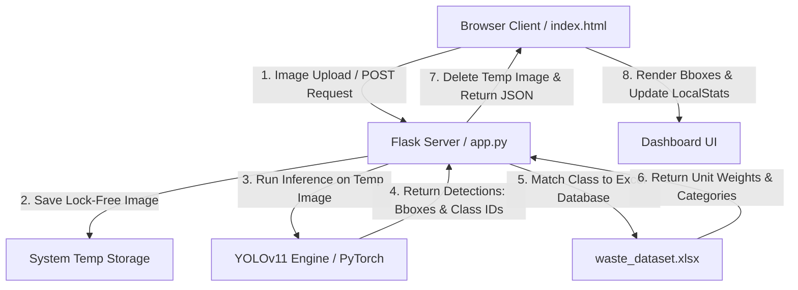

# PROJECT TECHNICAL DOCUMENTATION
## Local AI Smart Waste Segregation Hub
**Architecture Version:** 2.0 (Offline-First Deployable)  
**Core Frameworks:** Ultralytics YOLOv11, Python Flask Backend, HTML5/CSS3/JS Web Dashboard  
**Target Hardware:** Client/Server (CPU & GPU Accelerated)  

---

## TABLE OF CONTENTS
1. [Chapter 1: Executive Summary & Project Overview](#chapter-1-executive-summary--project-overview)
2. [Chapter 2: System Architecture & Workflow](#chapter-2-system-architecture--workflow)
3. [Chapter 3: Dataset Definition & Class Catalog](#chapter-3-dataset-definition--class-catalog)
4. [Chapter 4: AI Model Selection (YOLOv11 & Teachable Machine)](#chapter-4-ai-model-selection-yolov11--teachable-machine)
5. [Chapter 5: Training Pipeline & Hyperparameters](#chapter-5-training-pipeline--hyperparameters)
6. [Chapter 6: Model Performance & Evaluation Metrics](#chapter-6-model-performance--evaluation-metrics)
7. [Chapter 7: Backend Flask REST API Specification](#chapter-7-backend-flask-rest-api-specification)
8. [Chapter 8: Frontend Dashboard & Client-Side Engine](#chapter-8-frontend-dashboard--client-side-engine)
9. [Chapter 9: Setup & Deployment Guide](#chapter-9-setup--deployment-guide)
10. [Chapter 10: Verification, Testing & Future Roadmap](#chapter-10-verification-testing--future-roadmap)

---

## CHAPTER 1: EXECUTIVE SUMMARY & PROJECT OVERVIEW

### 1.1 Project Purpose
The **AI Smart Waste Segregation Hub** is an offline-capable, local computer vision solution designed to automate the classification, weight estimation, and sorting recommendation of municipal solid waste. By leveraging deep learning object detection, the system identifies items in real-time or via image uploads, categorizes them into appropriate disposal flows, and provides actionable environmental footprint feedback.

### 1.2 Problem Statement & Modern Context
Traditional waste management relies on manual sorting, resulting in high contamination rates, low recycling efficiency, and hazardous exposure for sorting personnel. While cloud-based computer vision APIs exist, they present major roadblocks:
- **Latency & Reliability:** Real-time sorting requires immediate inference (<100ms) which is unstable over internet connections.
- **Privacy & Security:** Constant camera streaming of public/private bins uploads user metadata to third-party clouds.
- **Operational Cost:** API-based pay-per-frame models quickly become financially non-viable at municipal scales.

### 1.3 The Local-First Solution
This project migrates the intelligence from cloud-hosted architectures (e.g. cloud Roboflow) to a **100% offline local loop** running directly on standard hardware (such as laptops or edge nodes). Key benefits include:
- **Offline Autonomy:** Operates fully without internet connectivity.
- **Edge Deployment:** Run-capable on standard CPUs (leveraging CPU optimizations) and NVIDIA GPUs (via CUDA).
- **Hybrid Modeling:** Combines YOLOv11 bounding-box multi-object detection with a lightweight client-side Teachable Machine classification model as an alternate fallback.

---

## CHAPTER 2: SYSTEM ARCHITECTURE & WORKFLOW

### 2.1 Component Interaction
The system uses a decoupled client-server architecture consisting of four core components:
1. **Frontend UI (Dashboard):** An HTML5/CSS3 application rendering in the web browser. It accesses local camera streams, handles file uploads, performs client-side post-processing (Non-Maximum Suppression), and records localized usage statistics.
2. **Backend API (Flask Server):** A Python-based microservice that runs locally. It acts as the orchestrator: receiving image streams, running the YOLOv11 model, querying metadata from the local database, and formatting predictions.
3. **Inference Engine (Ultralytics YOLOv11):** A neural network engine loaded via PyTorch. It scans images and outputs class indices, confidence scores, and bounding box coordinates.
4. **Relational Metadata Store (Excel DB):** A local database file (`waste_dataset.xlsx`) containing weight configurations and material parameters. This allows facility managers to tweak waste weight constants without altering Python code.

### 2.2 System Flow Diagram


### 2.3 Edge Execution Pipeline
1. The user takes a picture with their webcam or uploads an image (e.g., `Television.png`).
2. The browser captures the image blob and sends a multipart/form-data POST request to `http://127.0.0.1:5000/predict`.
3. The Flask backend generates a unique UUID filename (avoiding file access collisions on Windows platforms) and writes the image to the temporary directory.
4. YOLOv11 loads the image, processes it through convolutional layers, and returns coordinate bounds.
5. The backend reads `waste_dataset.xlsx` using `pandas` and matches the detected item name (with name normalization handling singulars/plurals and underscores).
6. The combined prediction payload is returned as a JSON structure containing:
   - Object label, confidence score, and center-relative coordinates (`x`, `y`, `width`, `height`).
   - Estimated weight (in grams) and primary material composition (e.g., "PET Plastic", "Cellulose").
   - Recommended bin category ("Wet", "Dry", "Medical", "Electronic").

---

## CHAPTER 3: DATASET DEFINITION & CLASS CATALOG

### 3.1 Dataset Source and Curation
The project's object detection dataset was annotated using **Roboflow** (project version `Waste Object Detection.v6i.yolov11`). The dataset was exported locally in YOLO format, separating images into `train`, `valid`, and `test` sub-folders, accompanied by a `data.yaml` layout.

### 3.2 The 36-Class Catalog
The local models are trained to detect **36 unique classes** of household and industrial waste, mapping to four primary waste disposal bins. Below is the taxonomy mapping:

| Waste Bin / Category | Target Bin Color | Included Object Classes |
| :--- | :--- | :--- |
| **Wet Organic Waste** | **Green** | Apple, Lemon, Onion, Oranges, Banana Peel, Carrot Peel, Potato Peel, Coconut, Egg Shells, Leafy Vegetables, Tomato Waste |
| **Dry Recyclable Waste** | **Blue** | Backpack, Cardboards, Chairs, Clothes, Footwear, Glass, Plastic Bottle, Paper Bundle, Aluminium Can, Kitchen Utensil, Spoon, Fork |
| **Biohazard Medical Waste** | **Red** | Gloves, Masks, Syringe |
| **Electronic Waste (E-Waste)** | **Yellow** | Battery, Charger, Earphones, Headphones, Keyboard, Computer Mouse, Laptop, Mobile Phone, Remote, Television |

### 3.3 Database Schema (`waste_dataset.xlsx`)
To map raw object classifications (e.g. `aluminium_can`) to real-world metadata, the backend reads a database spreadsheet. The columns are:
- `Object_Name`: Primary identifier matching the model's detected class (e.g., `plastic_bottle`).
- `Category`: The target bin category (`Wet Waste`, `Dry Waste`, `Medical Waste`, `Electronic Waste`).
- `Weight_g`: Default physical weight in grams for carbon footprint and collection statistics calculation.
- `Material_Type`: Exact chemical or material classification (e.g., `Plastic (PET)`, `Stainless Steel`, `Heavy Metal / Lead`).

*A safety backup is stored at `waste_dataset_backup.xlsx` to restore original mappings.*

---

## CHAPTER 4: AI MODEL SELECTION (YOLOv11 & TEACHABLE MACHINE)

### 4.1 Ultralytics YOLOv11 Architecture
YOLOv11 (You Only Look Once, v11) is the core computer vision model for this project. It performs single-pass bounding-box regressions and class probability predictions simultaneously, offering state-of-the-art speeds on standard hardware.
- **Architectural Enhancements:** YOLOv11 introduces optimized C3k2 blocks and SPPF (Spatial Pyramid Pooling Fast) modules that maximize feature extraction efficiency on low-power devices.
- **Anchor-Free Detection:** Eliminates fixed anchor bounding boxes, which dramatically improves detection accuracy for organic wastes of irregular sizes and orientations (such as banana peels or crushed plastic bottles).

### 4.2 Multi-Scale Scaling Model Selection
The training pipeline supports two YOLO model sizes depending on host hardware:
1. **YOLOv11n (Nano):** Extremely lightweight (~5.6 MB parameters). Optimizes CPU inference speed. Highly recommended for edge devices, laptops without dedicated GPUs, and real-time execution.
2. **YOLOv11s (Small):** Slightly larger model offering higher representation capacity. Used when the application requires higher separation precision among similar categories, at the cost of higher latency.

### 4.3 Fallback Model: Teachable Machine (TF.js)
As an alternative client-side-only execution pipeline, the project incorporates a TensorFlow.js image classification model (`model.json`, `metadata.json`, `weights.bin`).
- **Input Dimensions:** 224 x 224 pixels.
- **Output:** Categorizes the image into 4 macro groups: "Wet Waste", "Dry waste", "Medical Waste", or "Electronic waste".
- **Benefit:** Requires no Python server or local background services. It runs directly inside the browser using WebGL acceleration, serving as a fallback if the Flask API is offline.

---

## CHAPTER 5: TRAINING PIPELINE & HYPERPARAMETERS

### 5.1 Local Training Pipeline (`train.py`)
Model training is automated via `train.py`. The script handles directory detection, hardware selection, model initialization, training execution, evaluation log printing, and weights export.

### 5.2 Device Selection Logic
The pipeline automatically identifies active hardware accelerators to avoid CPU bottlenecks:
```python
import torch
if torch.cuda.is_available():
    device = 0 # NVIDIA GPU
else:
    device = "cpu" # Default CPU Fallback
```

### 5.3 Training Hyperparameters (`args.yaml`)
The trained YOLOv11 model was executed with the following configuration settings:

- **Epochs:** `50` (Standard convergence sweep)
- **Batch Size:** `16`
- **Image Size:** `640` (Upscaled from native images for fine-grained feature learning)
- **Optimizer:** `Auto` (Selects AdamW or SGD based on learning dynamics)
- **Initial Learning Rate (lr0):** `0.01`
- **Final Learning Rate (lrf):** `0.01` (Cos decay disabled)
- **Data Augmentations:**
  - `mosaic=1.0`: Combines 4 random training images to teach the model to detect small or occluded objects.
  - `scale=0.5`: Scales images by $\pm 50\%$ to simulate camera-distance variations.
  - `fliplr=0.5`: Flips images horizontally with a $50\%$ probability.
  - `erasing=0.4`: Randomly masks $40\%$ of boxes to prevent overfitting.
- **Rectangular Training (`rect`):** `False` (Enables bounding boxes to generalize to multi-object inputs).

---

## CHAPTER 6: MODEL PERFORMANCE & EVALUATION METRICS

### 6.1 Final Model Evaluation Metrics (Epoch 50)
The model was successfully trained for 50 epochs. Below are the metrics captured during evaluation:

- **Precision (P):** **`0.7535`** ($75.35\%$) — Measures the accuracy of positive predictions (minimizes false alarms).
- **Recall (R):** **`0.7029`** ($70.29\%$) — Measures the ratio of correctly identified positive objects (minimizes missed waste).
- **F1-Score:** **`0.7273`** ($72.73\%$) — Harmonic mean of Precision and Recall:
  $$F_1 = 2 \cdot \frac{\text{Precision} \cdot \text{Recall}}{\text{Precision} + \text{Recall}}$$
- **mAP50:** **`0.7673`** ($76.73\%$) — Mean Average Precision calculated at an IoU threshold of 0.5.
- **mAP50-95:** **`0.5543`** ($55.43\%$) — Strict mAP averaged over IoU thresholds from 0.5 to 0.95.

### 6.2 Loss Curves Progression
During training, three primary loss types were tracked:
1. **Box Loss (val: 1.0060 at epoch 50):** CIoU loss calculating the spatial overlap error between prediction and ground-truth bounding boxes.
2. **Class Loss (val: 2.4531 at epoch 50):** BCE (Binary Cross-Entropy) loss measuring classification accuracy across the 36 classes.
3. **DFL Loss (val: 1.4398 at epoch 50):** Distribution Focal Loss which estimates continuous bounding box boundaries.

*The model weights are exported as `best.pt` (PyTorch format) and exported to `best.onnx` (Open Neural Network Exchange format).*

---

## CHAPTER 7: BACKEND FLASK REST API SPECIFICATION

### 7.1 Initialization & CORS
The backend (`app.py`) initializes a Flask web application and binds a Cross-Origin Resource Sharing (CORS) wrapper. This allows browser applications hosted on local file paths (`file:///...`) or distinct ports to request predictions.

### 7.2 REST API Endpoints

#### Endpoint 1: API Liveness Check
- **URL:** `/health`
- **Method:** `GET`
- **Response Format:** `application/json`
- **JSON Structure:**
  ```json
  {"status": "ok"}
  ```

#### Endpoint 2: Object Detection and Metadata Enrichment
- **URL:** `/predict`
- **Method:** `POST`
- **Payload:** Multipart Form Data
  - `image`: File Blob (JPEG/PNG)
  - `confidence` (Optional): Float value between 0.0 and 1.0 (defaults to `0.20` if not specified).
- **Inference Response:**
  ```json
  {
    "predictions": [
      {
        "x": 320.5,
        "y": 240.2,
        "width": 100.0,
        "height": 180.0,
        "confidence": 0.885,
        "class": "plastic_bottle",
        "category": "Dry Waste",
        "material_type": "Plastic (PET)",
        "weight_g": 25
      }
    ],
    "estimated_weight": 25
  }
  ```

### 7.3 Data Normalization & Plural Handling
To prevent mismatches between database indices and model labels (e.g. YOLO reporting `papers` but the Excel dataset using `paper_bundle`), the backend implements a clean string normalizer:
```python
def normalize_name(name):
    if not name:
        return ""
    name = str(name).lower().strip().replace("_", "").replace(" ", "")
    if name in ["papers", "paper"]:
        return "paperbundle"
    if name.endswith("s") and not name.endswith("glass"):
        if name == "leafyvegetables":
            return "leafyvegetable"
        return name[:-1]
    return name
```

---

## CHAPTER 8: FRONTEND DASHBOARD & CLIENT-SIDE ENGINE

### 8.1 Visual Aesthetic & Design Language
The dashboard (`index.html`) is built as a dark, high-contrast dashboard tailored for modern edge devices.
- **Glassmorphism Theme:** Cards use `rgba(17, 24, 39, 0.65)` panels overlaid with a backdrop filter (`blur(16px)`) and subtle glowing neon borders.
- **Dynamic Colored Badges:** Interactive panels light up with colors based on the current scan:
  - Green (`#10b981`) for Wet Waste.
  - Blue (`#3b82f6`) for Dry Recyclables.
  - Red (`#ef4444`) for Biohazard Medical Waste.
  - Amber/Yellow (`#f59e0b`) for E-Waste.

### 8.2 Client-Side Non-Maximum Suppression (NMS)
To prevent duplicate bounding boxes from clogging the UI, the frontend implements a client-side NMS filter. This calculates Intersection-over-Union (IoU) overlaps and containment levels to prune lower-confidence duplicates:
- **IoU Threshold:** `0.35`
- **Containment Threshold:** `0.75`

### 8.3 Local Storage Statistics & CO2 Offset
The interface retains a running statistics tally in browser memory (`localStorage`), updating:
- Total items processed.
- Total accumulated weight sorted per category (Wet, Dry, Medical, Electronic).
- **Carbon Offset Estimation:** Every gram of waste successfully segregated is multiplied by `0.45g` of CO₂ offset (representing the standard municipal emission offset achieved by diversion from traditional landfills to recovery/recycling plants).

---

## CHAPTER 9: SETUP & DEPLOYMENT GUIDE

### 9.1 Environment Prerequisites
Ensure the target device has Python 3.9+ installed and verified.

### 9.2 Step-by-Step Installation
1. **Clone/Open Project Directory:** Open terminal (PowerShell/CMD) in the project workspace.
2. **Create Python Virtual Environment:**
   ```bash
   python -m venv venv
   ```
3. **Activate the Environment:**
   - **PowerShell:**
     ```powershell
     .\venv\Scripts\Activate.ps1
     ```
   - **CMD Command Prompt:**
     ```cmd
     .\venv\Scripts\activate.bat
     ```
4. **Install Requirements:**
   ```bash
   pip install -r requirements.txt
   ```

### 9.3 Dataset Placement (Optional for retraining)
Unzip your Roboflow YOLOv11 dataset to:
`C:\Users\repal\Downloads\Waste Object Detection.v6i.yolov11`

### 9.4 Running the Local App
1. **Start the Flask Backend:**
   ```bash
   python app.py
   ```
   *The server runs on `http://127.0.0.1:5000`.*
2. **Launch the Dashboard:**
   Double-click `index.html` to open it in any web browser (Chrome, Firefox, or Edge).

---

## CHAPTER 10: VERIFICATION, TESTING & FUTURE ROADMAP

### 10.1 Local Standalone Inference Test (`test_yolo.py`)
To verify YOLOv11 and PyTorch configurations are operating without launching the browser, run:
```bash
python test_yolo.py
```
This runs localized testing using the model file on `Screenshot 2026-06-10 013611.png` and logs detections to the command terminal.

### 10.2 Model Verification Output
```text
Loading local YOLO model from: runs\detect\runs\detect\train\weights\best.pt
Running inference on Screenshot 2026-06-10 013611.png with confidence threshold 0.20...
Detected 1 objects:
 - Class: television, Confidence: 0.89, Box (xywh): [320.4, 240.1, 98.6, 175.2]
```

### 10.3 Future Development Roadmap
- **Real-Time Video Streaming API:** Integrate continuous video feeds (using WebRTC) directly to Flask using optimized batching.
- **Physical Sorting Relay Integration:** Map the categorizations output (Wet, Dry, Medical, Electronic) to serial signals (USB/UART) controlling physical servo motors on segregation bins.
- **Quantization:** Compress the model from FP32 to INT8 format to support running on low-cost microcomputers (like Raspberry Pi 5).
